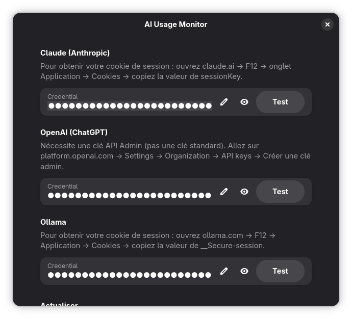

# AI Usage Monitor

<p align="center">
  <strong>A GNOME Shell extension that monitors your AI subscription usage in real-time</strong>
</p>

<p align="center">
  
</p>

<p align="center">
  
  
</p>

<p align="center">
  <a href="https://github.com/openhoat/ai-usage-monitor-gnome-extension/actions/workflows/ci.yml"></a>
  <a href="https://github.com/openhoat/ai-usage-monitor-gnome-extension/blob/main/LICENSE.txt"></a>
  
  
  
  
</p>

<p align="center">
  <a href="https://github.com/openhoat/ai-usage-monitor-gnome-extension/stargazers"></a>
  <a href="https://github.com/openhoat/ai-usage-monitor-gnome-extension/network/members"></a>
  <a href="https://github.com/openhoat/ai-usage-monitor-gnome-extension/issues"></a>
</p>

<p align="center">
  <a href="#features">Features</a> •
  <a href="#installation">Installation</a> •
  <a href="#configuration">Configuration</a> •
  <a href="#troubleshooting">Troubleshooting</a> •
  <a href="#development">Development</a>
</p>

---

## Supported Providers

| Provider | Authentication | Usage Data |
|----------|---------------|------------|
| **Claude** (Anthropic) | Session cookie | Tier usage (Standard 5h, Extended 7d) |
| **Ollama** | Session cookie | Usage percentage by model |
| **OpenAI** | API key | Monthly costs by model |

## Features

- **Multi-provider support** — Monitor Claude, OpenAI, or other AI services
- **Real-time usage display** — Shows your current usage percentage in the GNOME top bar
- **Multi-tier support** — Displays usage breakdown by tier or model
- **Visual indicators** — Color-coded usage levels (violet < 50%, orange 50-80%, red > 80%)
- **Dropdown menu** — Detailed breakdown with progress bars
- **Reset countdown** — Shows when your usage will reset
- **Configurable refresh** — Set custom refresh interval (5-120 minutes)

## Installation

### Prerequisites

- GNOME Shell 49
- Node.js 22+ (for the fetch script)
- Volta (recommended) or npm

### Quick Install

```bash
git clone https://github.com/openhoat/ai-usage-monitor-gnome-extension.git
cd ai-usage-monitor-gnome-extension
bash scripts/install.sh
```

After installation, log out and log back in (Wayland) or restart GNOME Shell (X11: `Alt+F2` → `r`).

### Enable the Extension

```bash
gnome-extensions enable ai-usage-monitor@openhoat.dev
```

## Configuration

Open the extension preferences to select your provider and enter credentials:

```bash
gnome-extensions prefs ai-usage-monitor@openhoat.dev
```

### Claude Setup

1. Open [claude.ai](https://claude.ai) and log in
2. Open Developer Tools (`F12`)
3. Go to **Application → Cookies → `https://claude.ai`**
4. Copy the value of `sessionKey`
5. In the extension preferences, select **Claude (Anthropic)** and paste the session key

### OpenAI Setup

1. Go to [platform.openai.com/api-keys](https://platform.openai.com/api-keys)
2. Create a new API key
3. In the extension preferences, select **OpenAI (ChatGPT)** and paste the API key

### Ollama Setup

1. Open [ollama.com](https://ollama.com) and log in
2. Open Developer Tools (`F12`)
3. Go to **Application → Cookies → `https://ollama.com`**
4. Copy the value of the session cookie
5. In the extension preferences, select **Ollama** and paste the session cookie

### Refresh Interval

By default, the extension refreshes usage data every 30 minutes. You can adjust this in the preferences (5-120 minutes).

## Troubleshooting

### Extension not appearing after installation

On Wayland, you need to log out and log back in for GNOME Shell to detect new extensions.

### "Node.js not found" error

Make sure Node.js is installed and accessible. The extension looks for Node.js in:

- `~/.volta/bin/node` (Volta)
- `/usr/bin/node`
- `/usr/local/bin/node`

### "Auth expired" error

Your credential has expired. Get a fresh one from your provider and update it in the extension preferences.

### Extension shows errors

Check the GNOME Shell logs:

```bash
journalctl -f /usr/bin/gnome-shell | grep -i usage
```

## Development

### Build

```bash
npm run build
```

### Test the fetch script

```bash
node dist/fetch-usage.js claude <your-session-cookie>
node dist/fetch-usage.js ollama <your-session-cookie>
node dist/fetch-usage.js openai <your-api-key>
```

### Run tests

```bash
npm test
```

### Validate code quality

```bash
npm run validate
```

## License

[MIT](LICENSE.txt)

## Author

Olivier Penhoat — [openhoat@gmail.com](mailto:openhoat@gmail.com)
